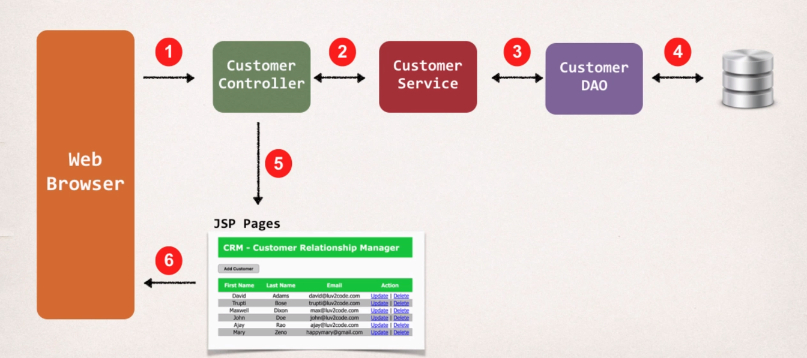
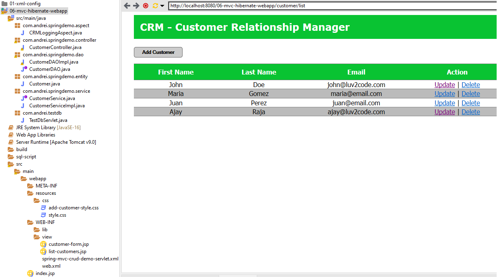

# 06-mvc-hibernate-webapp
Spring MVC and Hibernate learning project that connects to a database.  

Customer Relationship Manager.  

List customers from a database to a web page.  
Add new customer.  
Update existing customer.  
Delete customer.  

Use Spring AOP @Before and @AfterReturning to colect info on the methods.

Create and run:   
  - Create database with one table customer. File to crate database are in sql_script folder.
  - Create New Dynamic Web Project;
  - Create a servlet to test DB;
  - Create Entity, DAO, Service, Controller, View;
  - Create Aspect;
  - Run As – Run on Server;

Config files:   
  - web.xml  
  - spring-mvc-crud-demo-servlet.xml  
  
LIB:   
  - Spring support: spring –lib; 
  - Hibernate support: hibernate – lib – required; hibernate- lib – optional –c3po ;
  - mysql-connector  
  - AOP support:  aspectJwever,  
  - javax.servlet.jsp.jstl-api-1.2.1, javax.servlet.jsp.jstl-1.2.1.
(Not a Maven project)  

CRM:  
   

[BACK TO START PAGE](https://github.com/FlorescuAndrei/Start.git) 
